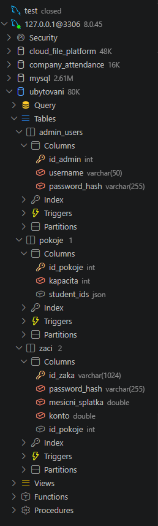

```sql
// Databaze pokoju, zaku, adminu a plateb

Table pokoje {
  id_pokoje integer [pk]
  kapacita integer
  student_ids json
}

Table zaci {
  id_zaka varchar [pk]
  name varchar
  password_hash varchar
  mesicni_splatka decimal
  konto decimal
  id_pokoje integer [ref: > pokoje.id_pokoje, null]
}

Table admin_users {
  id_admin integer [pk]
  username varchar [unique]
  password_hash varchar
}
```

https://dbdiagram.io